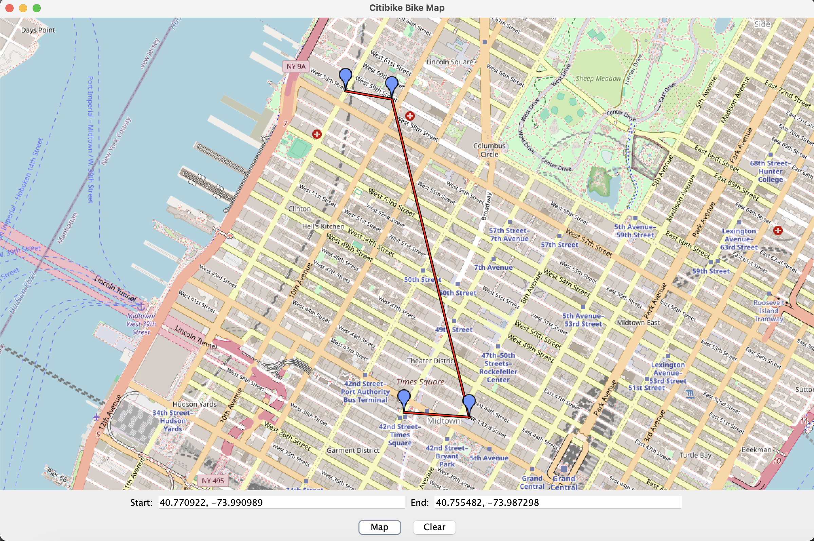

# Citibike Finder

The Citibike Finder project allows users to access live information about Citibike stations through Citibike's online JSON files. This data is used to locate nearby stations, check bike availability, and display relevant station details on a map.

Below are the dependencies and external resources used in this project:

## Dependencies

### [Retrofit](https://square.github.io/retrofit/)
Retrofit is used to fetch live JSON data from Citibike's servers.

### [RxJava](https://github.com/ReactiveX/RxJava)
RxJava is used alongside Retrofit for handling API calls.

### [JxMapViewer2](https://github.com/msteiger/jxmapviewer2/tree/master)
JxMapViewer2 is an open-source Java library for displaying and interacting with maps. This project uses JxMapViewer2 to display Citibike station locations and allow users to interact with the map.

## Citibike JSON Data

The Citibike stations provide live data in the form of JSON files. These files contain information about station locations, available bikes, and docks. The following links provide access to the live JSON data sources:

- [Citibike Station Data (JSON)](https://gbfs.citibikenyc.com/gbfs/en/station_information.json)
- [Citibike Availability Data (JSON)](https://gbfs.citibikenyc.com/gbfs/en/station_status.json)

These JSON files are updated in real-time, allowing users to access the most up-to-date information about the Citibike system.

## AWS Lambda
